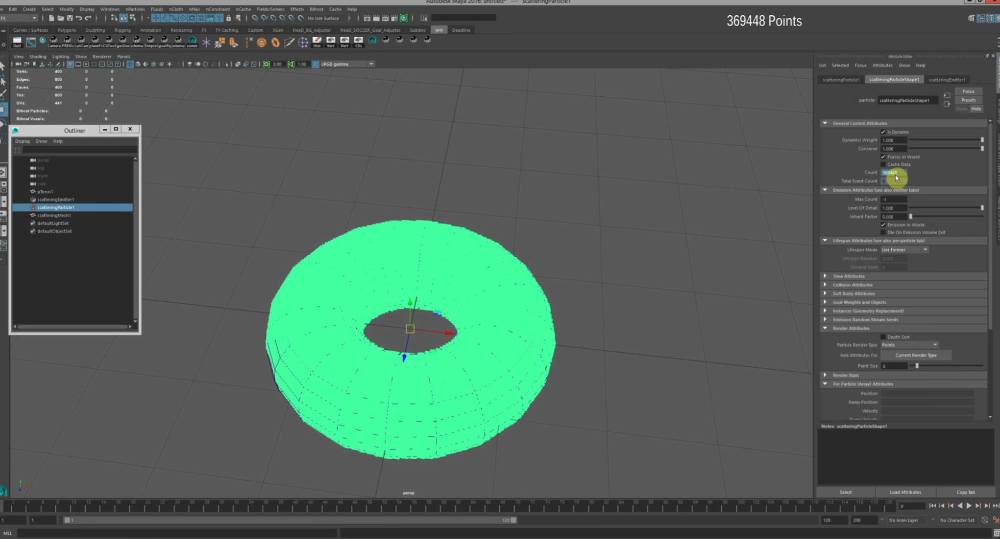
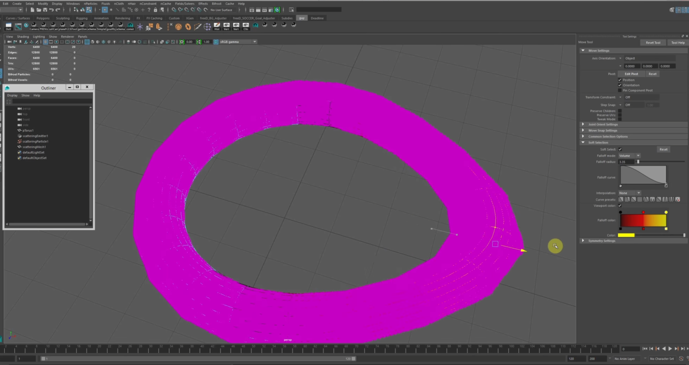
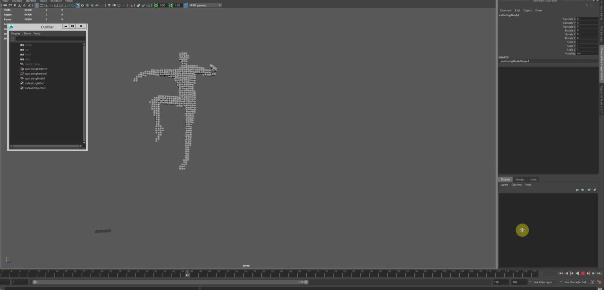
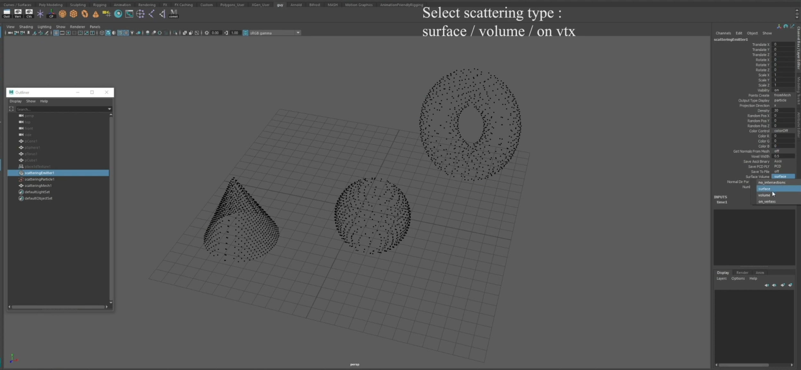

# Maya Scattering Plugin (Legacy)

## TL;DR
- Maya C++ plugin for fast surface and volume point-cloud generation.  
- Performance benchmarks show ~20× speed improvement (and often considerably more) 
   compared to Maya's built-in Particle File emitter (based on tests in Maya 2020).
- Supports color sampling, deforming meshes, multithreading, and PCD/PLY import / export. 
- Developed originally for internal use in my Intel team.  

---

## Overview
This is a Maya plugin written in C++, originally developed to support internal needs in my team at Intel.  
The tool generates point clouds either on the surface of a mesh or inside its volume, and it fully supports animated / deforming geometry.

It also performs shader-based color sampling, assigning each point the color coming from the mesh's texture or shading network.  
The plugin supports exporting the generated points (from the particle system) as point-cloud files in multiple formats (PCD, PLY, ASCII, Binary, Binary Compressed), allowing them to be used directly in external tools (also import).  
It can also display the points inside Maya either as a particle system or as a voxel-style mesh.

Performance was a key goal.  
The plugin generates points over 20× faster (and often far more) than Maya's built-in Particle File emitter.  

---

## Demo Images

### Volume Scatter


### Deforming Mesh Scatter


### Voxel-Style Mesh Preview


### Color Sampling From Shading Network


### Different Distribution Modes (Vertex / Surface / Volume)


---

## Demo Videos

<table>
  <tr>
    <td align="center"><b>Deforming Mesh Scatter</b></td>
    <td align="center"><b>Scatter + Color Sampling</b></td>
  </tr>
  <tr>
    <td>
      <a href="https://www.youtube.com/watch?v=RGPSw1fAKh4">
        
      </a>
    </td>
    <td>
      <a href="https://www.youtube.com/watch?v=eiWVBHLJk74">
        
      </a>
    </td>
  </tr>
</table>


---

## Features
- Surface scattering.  
- Volume scattering.  
- Shader-based color sampling.  
- Support for deforming / animated meshes.  
- Export to PCD and PLY (ASCII / Binary / Compressed).  
- Import of point clouds via Open3D.  
- Display inside Maya as either a particle system or as a voxel-style mesh.  
- Multithreaded point generation.  

---

## Algorithm (High-Level)
The tool avoids evaluating every point individually.  
Instead, it projects a regular grid from one side of the mesh's bounding box into the geometry.  
For each projection line, it detects only the **first** and **last** intersection points with the mesh.  
All points between these two intersections are generated as a continuous line of points.  
This approach eliminates most per-point inside/outside checks and enables the 20×+ performance improvement.
(The performance gap increases as the requested point count grows, making the advantage even more significant for heavy datasets).

---

## Architecture
- A single custom `MPxEmitterNode` handles all point generation.  
- A supporting `MPxCommand` builds the scattering setup (emitter, particle system, connections).  
- Visualization is done either via particles or via a voxel-style mesh created by the plugin.

---

## Dependencies
- Maya C++ API (MPxEmitterNode, MPxCommand, MThreadPool).  
- Open3D (point-cloud loading and saving: PLY/PCD).
- Boost C++ Libraries.
- Standard C++17 multithreading and containers . 

---

## Build Requirements
- C++17
- Windows 10 
- Maya 2020 SDK 
- Visual Studio 2019 (MSVC 142 toolset)
- Open3D 1.1.1 (headers + libs placed under `/3rdparty/open3d/`)
- Boost C++ Libraries  
  Required modules:  
  - `boost::filesystem` (directory & file detection)  
  - `boost::algorithm` (replace_all, join)


---

## Usage

#### Load the plugin
```python
cmds.loadPlugin(r"C:\ReplayCode\MayaModules\plugins\scatteringNode.mll")
```

#### Create a scattering node
```python
cmds.scatteringNodeCmd()
```

#### Create the node using selected meshes
```python
cmds.scatteringNodeCmd()
```

#### Create the node with a list of mesh names
```python
cmds.scatteringNodeCmd('pSphere1', 'pCone1', 'pCube1')
```

#### Create the node with a file path for exporting
```python
cmds.scatteringNodeCmd(filePath="D:/mayaTests/scatteringNode/PCD/test9.ply")
```

#### Create the node with file path and mesh list
```python
cmds.scatteringNodeCmd('pSphere1', 'pCone1', 'pCube1',
                       filePath="D:/mayaTests/scatteringNode/PCD/test9.ply")
```

#### Create the node with randomized point positions
```python
cmds.scatteringNodeCmd(randomPos=0.75)
```

---

## Command Flags

```
--name        : Name of the created scattering setup
--filePath    : Path for exporting the generated point cloud
--randomPos   : Enables randomized scattering mode
```

---

## Return Values
```python
['scatteringEmitter1', 'scatteringParticleShape1', 'scatteringMeshShape1']
```

---

## Known Issues
- Undo/redo for the command is not implemented.  
- Import pipeline still relies on a single-thread stage in heavy files.  
- Error handling around Open3D exceptions is minimal.
- The scatteringNode currently handles several unrelated concerns 
  -(scattering, color sampling, file I/O, threading, and geometry utilities) 
  -within a single implementation. This leads to a large source file that works well 
  -for a legacy tool, but would likely be split into smaller modules in a modern codebase for clarity and maintainability.

---

## Roadmap (Future Improvements)
- Refactor export system into a standalone module.  
- Support for more point-cloud formats (LAS, E57).  
- Better error handling and logging.  
- Implement undo/redo support for the command.

---

## Status
Legacy plugin.  
Designed for Maya 2020, Visual Studio 2019, and Open3D v1.1.1, Boost.  
Kept publicly to demonstrate experience with C++, Maya API, geometry processing, multithreading, and point-cloud tooling.  
Not actively maintained.

---

## License

Copyright (c) Guy Perry. All Rights Reserved.

This code is provided for portfolio/educational purposes only.
Unauthorized use, copying, or distribution is prohibited.
